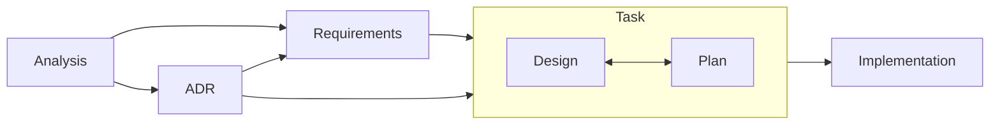

# AGENTS.md

## Documentation Language Policy

All documentation output in this project must be written in English, including:

- Code comments
- Commit messages
- Architecture Decision Records (ADRs)
- README files
- API documentation
- Error messages
- User-facing documentation
- Test descriptions
- TODO comments
- Any other written documentation

## Project Overview

### User Documentation

## Agent Operating Environment

### Planning and Tooling Discipline

## Developer Principles

### Memory Safety Over Micro-optimization

- Prioritize memory safety and correctness over micro-optimizations
- Accept reasonable overhead (e.g., cloning small strings) to avoid memory leaks
- Follow Rust's ownership model strictly - avoid `unsafe` code and memory leaks from techniques like `Box::leak()`
- When faced with lifetime complexity, prefer simpler solutions that may use slightly more memory but are correct
- Example: Clone strings for HTTP headers instead of using `Box::leak()` to create static references

### Code Clarity

- Write clear, readable code that is easy to understand and maintain
- Use descriptive variable and function names
- Add comments for complex logic, but prefer self-documenting code
- Structure code to minimize cognitive load for future developers

### Clean Code Maintenance

- Remove unused variables, parameters, and struct members promptly
- When refactoring, trace through all callers to eliminate unnecessary parameters
- Keep structs lean by removing fields that are no longer used
- Use `cargo clippy` to identify unused code elements
- Example: If a function parameter like `arch` is no longer used in the implementation, remove it from the function signature and update all callers

### Prefer Functions Over Structs Without State

- When there's no state to manage, prefer implementing functionality as standalone functions rather than defining structs
- Only create structs when you need to maintain state, implement traits, or group related data
- This keeps the code simpler and more straightforward
- Example: For utility operations like file validation or string parsing, use functions directly instead of creating a struct with methods

### Avoid Generic "Manager" Naming

- When the name "manager" appears in file names, structs, traits, or similar constructs, consider more specific and descriptive alternatives
- "Manager" is often too abstract and doesn't clearly communicate the responsibility
- Choose names that describe what the component actually does
- Examples of better alternatives:
  - `FileManager` → `FileSystem`, `FileStore`, `FileRepository`
  - `ConnectionManager` → `ConnectionPool`, `ConnectionFactory`
  - `TaskManager` → `TaskScheduler`, `TaskExecutor`, `TaskQueue`
  - `ShimManager` → `ShimInstaller`, `ShimRegistry`, `ShimProvisioner`
- This principle helps maintain code clarity and makes the codebase more intuitive

### Avoid Vague "Util" or "Utils" Naming

- Never use "util" or "utils" in directory names, file names, class names, or variable names
- These terms are too generic and don't clearly convey the purpose or responsibility
- Always choose specific names that describe the actual functionality
- Examples of better alternatives:
  - `utils/strings.rs` → `string_operations.rs`, `text_processing.rs`, `string_formatter.rs`
  - `FileUtils` → `FileOperations`, `FileSystem`, `PathValidator`
  - `DateUtil` → `DateFormatter`, `DateParser`, `TimeCalculator`
  - `CommonUtils` → Split into specific modules based on functionality
  - `util_function()` → Name based on what it does: `validate_input()`, `format_output()`
- This principle ensures code is self-documenting and responsibilities are clear

### Module Placement Consistency

- Consult `docs/architecture.md` before creating or moving modules so directory structure stays aligned with the documented layout.
- Keep platform-dependent code under `src/platform/` (and its submodules) and expose only cross-platform interfaces from higher layers.
- When introducing new components, document their location rationale in the relevant design or plan to aid future maintainers.

### Prevent Circular Module Dependencies

- Keep the module graph acyclic so features remain testable and maintainable.
- Favor dependency inversion (traits, interfaces) or data transfer structures instead of bidirectional imports when modules must collaborate.
- If a new dependency would close a cycle, refactor by extracting shared functionality into a dedicated module documented in the architecture references.
- Run dependency analysis tools or targeted `cargo check` commands when restructuring to confirm cycles are not introduced.

### Logging Standards

- **Always use the abstracted logging macros** defined in `src/core/logging.rs` for all log output
- **Never use `defmt` directly** - use the crate-level macros instead:
  - `crate::log_info!(...)` - Informational messages
  - `crate::log_warn!(...)` - Warning messages
  - `crate::log_error!(...)` - Error messages
  - `crate::log_debug!(...)` - Debug messages
  - `crate::log_trace!(...)` - Trace-level messages
- **DO NOT add `#[cfg(feature = "pico2_w")]`** guards around logging calls - the macros handle target-specific behavior internally
- The logging macros automatically:
  - Use `defmt` on embedded targets (pico2_w feature)
  - Use `println!` in host tests
  - Compile to no-op in other contexts
- This abstraction centralizes conditional compilation and keeps logging code clean and portable

## Traceable Development Lifecycle (TDL)

_Structured phases, linked artifacts, verifiable outcomes_

This project follows the Traceable Development Lifecycle (TDL), a structured development process with full traceability from discovery through delivery. Consult the primary references when in doubt:

**[`docs/tdl.md`](docs/tdl.md)** - Full TDL documentation and workflow\
**[`docs/templates/README.md`](docs/templates/README.md)** - Template descriptions and usage instructions

### TDL Process Overview



### Key Locations

- **Templates**: `docs/templates/` - All document templates
- **Analysis**: `docs/analysis/AN-<id>-<topic>.md` - Problem exploration
- **Requirements**: `docs/requirements/FR-<id>-<capability>.md` and `NFR-<id>-<quality>.md` - Formal requirements
- **ADRs**: `docs/adr/ADR-<id>-<title>.md` - Architecture decisions (current format)
- **Tasks**: `docs/tasks/T-<id>-<task>/` - Design and plan documents (current format)
- **Traceability**: `docs/traceability.md` - Central mapping matrix

### Document Workflow & Approvals

**Cross-Stage Governance**

- **Approval Rules**
  - **Stage Separation**: Complete only one stage per approval cycle; never advance without an explicit “go”.
  - **Clarity Guardrail**: Treat ambiguous instructions as cues to request confirmation.
  - **Status Maintenance**: Keep document metadata current so reviewers know the active phase.

- **Exception Handling**
  - **Immediate Pause**: If work advanced without the required approval—or a prerequisite artifact is missing—stop immediately.
  - **User Decision**: Ask whether to delete the premature work and restart or treat it as a draft for sequential review.
  - **Upstream Gap**: When a needed analysis, requirement, or ADR is absent, suspend implementation, create the missing document via templates, secure approval, and only then resume coding.

**Stage-by-Stage Flow**

1. **Analysis (`docs/analysis/AN-…`)**
   - **Deliverable**: Problem statement with context, alternatives, and recommendation.
   - **Approval Gate**: Share the draft and wait for explicit approval before drafting requirements.

2. **Requirements (`docs/requirements/FR-…` / `NFR-…`)**
   - **Deliverable**: Verifiable functional and non-functional requirements derived from the approved analysis.
   - **Approval Gate**: Present the requirements and wait for explicit approval before writing the ADR.

3. **Architecture Decision (`docs/adr/ADR-…`)**
   - **Deliverable**: Decision record describing the structural approach that satisfies the requirements.
   - **Approval Gate**: Submit the ADR and wait for explicit approval before creating the task package.

4. **Task Package (`docs/tasks/T-…/`)**
   - **Deliverable**: Task directory with `design.md`, `plan.md`, and an updated `README.md` linked to upstream artifacts.
   - **Approval Gate**: Share the task documents and wait for explicit approval before starting implementation.

5. **Implementation**
   - **Deliverable**: Code and supporting assets tied to the approved task.
   - **Approval Gate**:
     - Treat every phase listed in `plan.md` as its own approval checkpoint.
     - After finishing a phase, immediately stop, mark the corresponding checklist item as `[x]`, and request explicit approval to proceed.
     - Do not write code, run tests, or change artefacts for the next phase until that approval is received.
     - If approval is missing or unclear at any point, halt all implementation work and ask the approver how to proceed; the only permitted actions while waiting are housekeeping required to request approval (e.g., summarising work done or reverting unintended edits).

## Development Workflow

### Completing Work

#### Rust Code

When finishing any Rust coding task, always run the following commands in order and fix any issues:

1. `cargo fmt` - Auto-format code
2. `cargo clippy --all-targets -- -D warnings` - Check for linting errors in test code
3. `cargo test --lib --quiet` - Run unit tests (faster than full test suite)

Address any errors from each command before proceeding to the next. All must pass successfully before considering the work complete.

#### Markdown Documentation

When working on Markdown documentation (`.md` files), run the following commands in order:

1. `bun scripts/trace-status.ts --check` - Verify traceability integrity
   - Checks for missing or incorrect links between documents
   - Validates dependency consistency (prerequisite/dependent requirements)
   - Ensures task reciprocal links are correct
   - Fix any issues reported before proceeding to formatting

2. `bun format` - Auto-format markdown files
   - Automatically fixes formatting issues
   - Ensures consistent markdown style across all documentation

3. `bun lint` - Check markdown linting
   - Identifies potential issues and violations
   - Common issues: trailing spaces, inconsistent indentation, missing blank lines
   - Fix any warnings or errors reported

All commands must pass successfully before considering the documentation work complete. After the document is finalized, compare it against the source template (for example, `docs/templates/analysis.md`) to confirm the Metadata, Links, and status selections remain consistent with the current standards.

### Documentation Updates

- Ensure documentation, comments, and messages remain in English.
- For Markdown changes, run `bun scripts/trace-status.ts --check` to verify traceability, then `bun format` followed by `bun lint` and resolve any reported issues before finalizing.
- If `docs/traceability.md` is missing or you add or remove any files under `docs/`, run `bun scripts/trace-status.ts --write` to regenerate the traceability matrix before completing the work.
- During implementation, mark the completed phase checkboxes in the relevant documents at the end of each phase so progress stays transparent and auditable.

## Essential Commands

- **Format**: `cargo fmt` - Format code using rustfmt
- **Lint**: `cargo clippy --all-targets -- -D warnings` - Run linter with strict warnings
- **Build**: `cargo build` (debug), `cargo build --release` (production)
- **Test**: `cargo test --lib --quiet` - Run unit tests efficiently

### Building for Embedded Targets (RP2350)

**IMPORTANT: Always use the build script for RP2350/Pico 2 W targets.**

- **Build examples**: `./scripts/build-rp2350.sh` - Build all examples and convert to UF2
- **Build specific example**: `./scripts/build-rp2350.sh scheduler_demo` - Build single example
- **Release build**: `./scripts/build-rp2350.sh --release scheduler_demo` - Optimized build

The script automatically:

1. Builds the example for `thumbv8m.main-none-eabihf` target
2. Converts ELF binary to UF2 format (required for flashing)
3. Places UF2 files in `target/` directory

**Flashing to Pico 2 W:**

```bash
# Method 1: Using probe-rs (recommended - shows defmt logs)
probe-rs run --chip RP2350 target/thumbv8m.main-none-eabihf/release/examples/scheduler_demo

# Method 2: Manual UF2 copy
# 1. Hold BOOTSEL button while connecting USB
# 2. Copy target/scheduler_demo.uf2 to mounted drive
# 3. Pico will automatically reboot and run
```

**Note**: Host tests and embedded builds use different targets. Do not use the default `cargo build` for embedded code.

## Additional Documentation

- **Architecture & Structure**: [`docs/architecture.md`](docs/architecture.md) - Project structure, components, and storage locations

## Communication Guidelines

- Default to concise, friendly teammate tone; structure responses for quick scanning without over-formatting.
- Lead code-change summaries with the key outcome, then reference affected paths with `path:line` format (no ranges).
- Use bullets (`-`) for lists, avoid nested bullets, and reserve headings for major sections only when helpful.
- Include suggested next steps (tests, commits, verification) when they naturally follow from the work performed.
- Do not paste entire file contents; reference file paths instead.
- When the user requests command output, summarize relevant lines rather than dumping full logs.
- Execute simple user requests via shell commands when appropriate (e.g., `date`), respecting the environment rules above.
