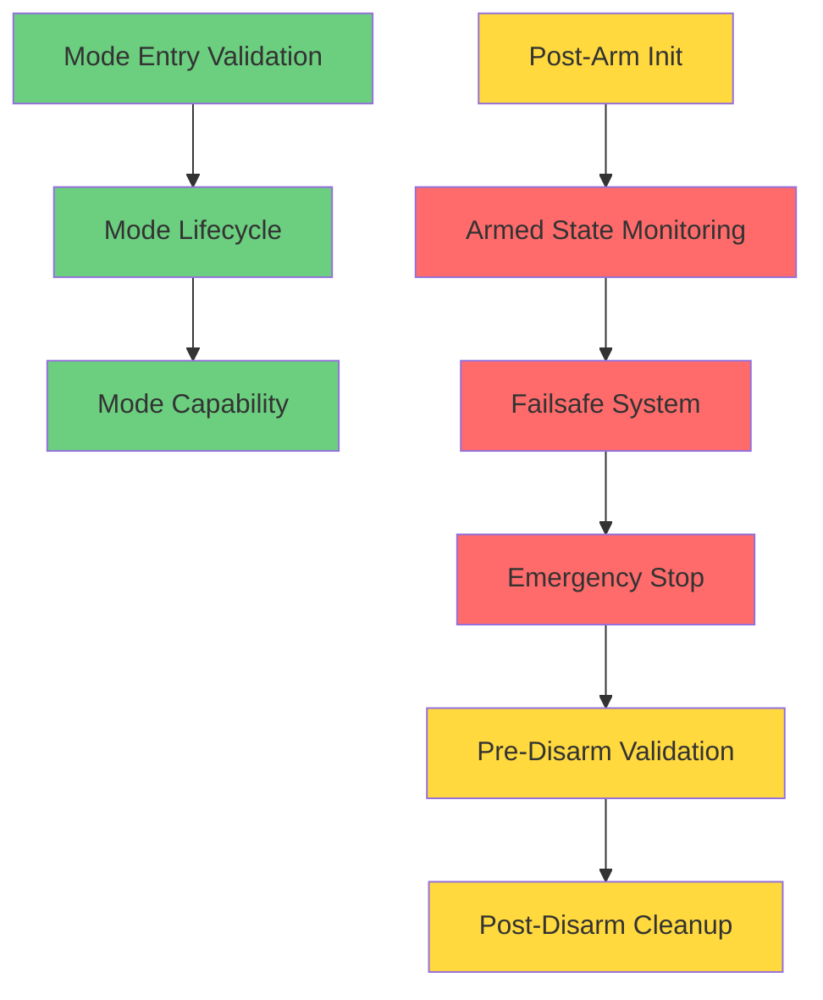

# Analysis Backlog - DISARM → ARM → Operation → DISARM Cycle

This document tracks missing analysis for the complete vehicle operation cycle.
Generated: 2025-11-03

## Status Legend

- 🔴 **CRITICAL** - Safety-critical, must implement before flight
- 🟡 **HIGH** - Required for feature completion
- 🟢 **MEDIUM** - Important for robustness
- ⚪ **LOW** - Nice to have

---

## Critical Priority Analysis (Safety-Critical)

### ✅ 1. Failsafe System - COMPLETE

**Document**: [`AN-kajh6-failsafe-system.md`](analysis/AN-kajh6-failsafe-system.md)

**Status**: ✅ Analysis Complete (2025-11-03)

**Gap**: No failsafe implementation exists. Vehicle will continue operating after RC loss, GCS loss, or battery depletion.

**ArduPilot Implementation**:

- RC Loss Failsafe (FS_TIMEOUT: 1.5s default)
- GCS Loss Failsafe (FS_GCS_TIMEOUT: 5s default)
- Battery Failsafe (voltage/capacity thresholds)
- Crash Detection (velocity/throttle monitoring)

**Required Analysis**:

- [x] Failsafe trigger conditions and timeout values
- [x] Failsafe actions (RTL, Hold, SmartRTL, Disarm)
- [x] Failsafe priority and override rules
- [x] Recovery procedures (how to regain control)
- [x] Failsafe state machine design
- [x] Parameter configuration (FS\_\_, BATT\_\_)

**Current pico_trail**: None - `find src -name "*failsafe*"` returns empty

**Impact**: Vehicle runaway, uncontrolled flight, battery over-discharge

**Next Steps**: Create requirements (FR-<id>) and ADR (<id>) based on this analysis

---

### ✅ 2. Armed State Continuous Monitoring - COMPLETE

**Document**: [`AN-dgpck-armed-state-monitoring.md`](analysis/AN-dgpck-armed-state-monitoring.md)

**Status**: ✅ Analysis Complete (2025-11-03)

**Gap**: After arming succeeds, no continuous monitoring of system health occurs during armed operation.

**ArduPilot Implementation**:

High-frequency (50-400 Hz):

- RC input monitoring (50 Hz)
- Sensor health (AHRS, IMU: 400 Hz)
- Emergency stop detection (400 Hz)

Medium-frequency (10 Hz):

- Failsafe checks
- Fence validation
- EKF health monitoring

Low-frequency (1 Hz):

- Home position updates
- Parameter synchronization
- Status reporting

**Required Analysis**:

- [x] Monitoring framework architecture
- [x] Check frequency requirements per subsystem
- [x] Health check implementations (RC, sensor, battery)
- [x] Degraded operation modes (partial sensor loss)
- [x] Monitoring task scheduling
- [x] Performance impact analysis

**Current pico_trail**: No continuous monitoring after `arm()` succeeds

**Impact**: Cannot detect RC loss, sensor failures, or battery depletion during flight

---

### ✅ 3. Emergency Stop - COMPLETE

**Document**: [`AN-4ez27-emergency-stop.md`](analysis/AN-4ez27-emergency-stop.md)

**Status**: ✅ Analysis Complete (2025-11-03)

**Gap**: No emergency stop mechanism exists. Cannot safely halt vehicle in critical situations.

**ArduPilot Implementation**:

`stop_vehicle()` function (mode.cpp:332-361):

- Controlled deceleration via `get_throttle_out_stop()`
- Steering lockout (0.0) during stop to prevent rollover
- Sail depressurization for sailboat variants
- Stopped state confirmation via boolean flag

**Required Analysis**:

- [x] Emergency stop trigger mechanisms (GCS command, RC switch, failsafe)
- [x] Gradual deceleration vs immediate cut-off
- [x] Actuator safety states during stop
- [x] Stop confirmation and verification
- [x] Integration with disarm logic
- [x] Recovery from emergency stop

**Current pico_trail**: None

**Impact**: Cannot perform safe emergency shutdown, rollover risk from abrupt stops

---

## High Priority Analysis (Feature Completion)

### ✅ 4. Post-Arm Initialization - COMPLETE

**Document**: [`AN-m4dpl-post-arm-initialization.md`](analysis/AN-m4dpl-post-arm-initialization.md)

**Status**: ✅ Analysis Complete (2025-11-03)

**Gap**: After `arm()` succeeds, only state changes to `Armed`. No subsystem initialization occurs.

**ArduPilot Implementation**:

- Arming event logging (`Log_Write_Arm()`)
- Terrain reference location setup
- Fence auto-enable
- GPIO pin state update
- FFT system preparation
- Arming timestamp recording (`last_arm_time_us`)
- Warning notification if checks disabled

**Required Analysis**:

- [x] Subsystem initialization sequence
- [x] Fence activation on arm
- [x] Logging requirements (event, timestamp, method)
- [x] Time-based logic initialization
- [x] Actuator initialization (neutral → ready)
- [x] Error handling during post-arm init

**Current pico_trail**:

```rust
self.armed = ArmedState::Armed;
Ok(())
```

**Impact**: Subsystems not synchronized with armed state, no audit trail, time-based features broken

---

### ✅ 5. Post-Disarm Cleanup - COMPLETE

**Document**: [`AN-081u0-post-disarm-cleanup.md`](analysis/AN-081u0-post-disarm-cleanup.md)

**Status**: ✅ Analysis Complete (2025-11-03)

**Gap**: After `disarm()`, only state changes to `Disarmed`. No cleanup or subsystem shutdown occurs.

**ArduPilot Implementation**:

- Disarm event logging (`Log_Write_Disarm()`)
- Forced logging check (continue logging based on disarm reason)
- Fence auto-disable
- FFT parameter persistence
- GPIO pin state update
- Optional safety switch force-on

**Required Analysis**:

- [x] Subsystem cleanup sequence
- [x] Actuator safety shutdown (verify neutral PWM)
- [x] Fence deactivation
- [x] Logging requirements (event, reason, timestamp)
- [x] State reset for next arm cycle
- [x] Error handling during cleanup

**Current pico_trail**:

```rust
self.armed = ArmedState::Disarmed;
Ok(())
```

**Impact**: Subsystems remain active after disarm, no audit trail, actuator safety not verified

**Next Steps**: Create requirements (FR-<id>) and ADR (<id>) based on this analysis

---

### ✅ 6. Pre-Disarm Validation - COMPLETE

**Document**: [`AN-dqzc6-pre-disarm-validation.md`](analysis/AN-dqzc6-pre-disarm-validation.md)

**Status**: ✅ Analysis Complete (2025-11-03)

**Gap**: Minimal validation before disarm. Can disarm during unsafe conditions.

**ArduPilot Implementation**:

- Armed state verification
- Throttle zero check (for rudder disarm)
- Disarm method validation
- Mode-specific restrictions (skid-steering Hold mode requirement)

**Required Analysis**:

- [x] Disarm validation checks (throttle, velocity)
- [x] Disarm method restrictions (GCS vs RC vs auto)
- [x] Forced disarm override mechanism
- [x] Validation failure reporting

**Current pico_trail**:

```rust
if !self.is_armed() {
    return Err("Already disarmed");
}
```

**Impact**: Can disarm with throttle active, can disarm during flight, unsafe disarm scenarios

**Next Steps**: Create requirements (FR-<id>) and ADR (<id>) based on this analysis

---

## Medium Priority Analysis (Robustness)

### ✅ 7. Mode Entry Validation - COMPLETE

**Document**: [`AN-5aniu-mode-entry-validation.md`](analysis/AN-5aniu-mode-entry-validation.md)

**Status**: ✅ Analysis Complete (2025-11-03)

**Gap**: Mode changes have no validation. Can switch to any mode regardless of system state.

**ArduPilot Implementation**:

`enter()` validation in Mode class:

- `requires_position()` - EKF position estimate required
- `requires_velocity()` - Velocity estimate required
- Sensor health checks (GPS, IMU, compass)
- Mode-specific prerequisites
- Disarmed exception (skip validation for pre-flight config)

**Required Analysis**:

- [x] Mode capability query system design
- [x] Sensor requirement validation per mode
- [x] EKF health checks
- [x] Mode transition validation framework
- [x] Validation failure reporting
- [x] Fallback mode selection

**Current pico_trail**:

```rust
// Mode change restrictions can be added here
// For now, allow all mode changes
self.mode = mode;
Ok(())
```

**Impact**: Can enter Auto mode without GPS, can enter Manual without IMU, unsafe mode transitions

**Next Steps**: Create requirements (FR-<id>) and ADR (<id>) based on this analysis

---

### ✅ 8. Mode Lifecycle Management - COMPLETE

**Document**: [`AN-9rbvh-mode-lifecycle-management.md`](analysis/AN-9rbvh-mode-lifecycle-management.md)

**Status**: ✅ Analysis Complete (2025-11-03)

**Gap**: No mode lifecycle concept. Modes switch instantly without initialization or cleanup.

**ArduPilot Implementation**:

- `enter()` - Mode initialization (called on mode entry)
- `exit()` - Mode cleanup (called on mode exit)
- `update()` - Continuous mode execution (called every control loop)

Example (MANUAL exit):

```cpp
void ModeManual::_exit() {
    g2.motors.set_lateral(0);  // Clear lateral motor
}
```

**Required Analysis**:

- [x] Mode trait design (enter/update/exit methods)
- [x] Mode state initialization requirements
- [x] Mode cleanup requirements (actuator reset, etc.)
- [x] Transition sequencing (old mode exit → new mode enter)
- [x] Error handling during lifecycle transitions
- [x] Resource management per mode

**Current pico_trail**: Instant mode switch, no lifecycle

**Impact**: Previous mode's actuator commands persist, memory leaks possible, unsafe transitions

**Next Steps**: Create requirements (FR-<id>) and ADR (<id>) based on this analysis

---

### ✅ 9. Mode Capability Declaration System - COMPLETE

**Document**: [`AN-g5w99-mode-capability-system.md`](analysis/AN-g5w99-mode-capability-system.md)

**Status**: ✅ Analysis Complete (2025-11-03)

**Gap**: No way to declare mode-specific requirements or restrictions.

**ArduPilot Implementation**:

Mode capability queries:

- `allows_arming()` - Can arm in this mode?
- `allows_arming_from_transmitter()` - Can RC arm in this mode?
- `has_manual_input()` - Requires pilot input?
- `is_autopilot_mode()` - Autonomous mode?
- `requires_position()` - Needs position estimate?
- `requires_velocity()` - Needs velocity estimate?

**Required Analysis**:

- [x] Capability declaration trait/interface design
- [x] Standard capability types (arming, sensors, manual input)
- [x] How pre-arm checks use capability declarations
- [x] How mode validation uses capability declarations
- [x] Mode-specific safety requirements
- [x] Capability query caching for performance

**Current pico_trail**: None

**Impact**: Cannot enforce mode-specific safety requirements, all modes treated identically

**Next Steps**: Create requirements (FR-<id>) and ADR (<id>) based on this analysis

---

## Existing Analysis (Already Covered)

### ✅ Pre-Arm Safety Checks

**Document**: `AN-r2fps-pre-arm-checks.md` (Status: Complete)

Covers validation before ARM transition:

- Pre-arm check framework (trait-based)
- RC input validation
- System state validation
- Actuator readiness validation
- ARMING_CHECK parameter

---

### ✅ Manual Control Implementation

**Document**: `AN-yqeju-manual-control-implementation.md` (Status: Draft)

Covers joystick operation during armed state:

- RC_CHANNELS message processing
- Manual mode implementation
- Actuator abstraction
- Safety enforcement (armed state check)

---

## Analysis Dependencies



---

## Recommended Implementation Order

### Phase 1: Critical Safety (Weeks 1-2)

1. **Failsafe System** - Prevents runaway
2. **Armed State Monitoring** - Detects failures during operation
3. **Emergency Stop** - Safe shutdown mechanism

### Phase 2: Operational Completeness (Weeks 3-4)

4. **Post-Arm Initialization** - Proper system startup
5. **Pre-Disarm Validation** - Safe shutdown conditions
6. **Post-Disarm Cleanup** - Proper system shutdown

### Phase 3: Robustness (Weeks 5-6)

7. **Mode Entry Validation** - Prevent invalid mode transitions
8. **Mode Lifecycle Management** - Clean mode transitions
9. **Mode Capability System** - Mode-specific requirements

---

## Reference: Complete Operation Cycle

```
┌─────────────────────────────────────────────────────────────┐
│ DISARM State                                                 │
│ - System boot                                                │
│ - Subsystems initialize                                      │
└────────────────────┬────────────────────────────────────────┘
                     │
                     ▼
          ┌──────────────────────┐
          │ Mode Change Request  │ ← 🟢 7. Mode Entry Validation
          │ (e.g., → MANUAL)     │ ← 🟢 8. Mode Lifecycle (enter)
          └──────────┬───────────┘
                     │
                     ▼
          ┌──────────────────────┐
          │   ARM Request        │
          └──────────┬───────────┘
                     │
                     ▼
          ┌──────────────────────┐
          │ Pre-Arm Checks       │ ← ✅ Already analyzed (AN-r2fps)
          └──────────┬───────────┘
                     │
                     ▼
          ┌──────────────────────┐
          │    ARM SUCCESS       │
          └──────────┬───────────┘
                     │
                     ▼
          ┌──────────────────────┐
          │ Post-Arm Init        │ ← 🟡 4. Post-Arm Initialization
          └──────────┬───────────┘
                     │
                     ▼
┌────────────────────────────────────────────────────────────┐
│ ARMED State - Continuous Monitoring                        │
│                                                             │
│  ┌───────────────────────────────────────────────┐        │
│  │ Control Loop (50-400 Hz)                      │        │
│  │  - Mode update (joystick → actuators)         │ ← ✅ AN-yqeju
│  │  - RC input monitoring                        │ ← 🔴 2. Monitoring
│  │  - Sensor health checks                       │        │
│  │  - Failsafe detection                         │ ← 🔴 1. Failsafe
│  │  - Emergency stop check                       │ ← 🔴 3. Emergency Stop
│  └───────────────────────────────────────────────┘        │
│                                                             │
│  Triggers:                                                 │
│  - RC loss → Failsafe                                      │
│  - GCS loss → Failsafe                                     │
│  - Battery low → Failsafe                                  │
│  - Emergency stop → Controlled halt                        │
└────────────────────┬───────────────────────────────────────┘
                     │
                     ▼
          ┌──────────────────────┐
          │  DISARM Request      │
          └──────────┬───────────┘
                     │
                     ▼
          ┌──────────────────────┐
          │ Pre-Disarm Checks    │ ← 🟡 6. Pre-Disarm Validation
          └──────────┬───────────┘
                     │
                     ▼
          ┌──────────────────────┐
          │   DISARM SUCCESS     │
          └──────────┬───────────┘
                     │
                     ▼
          ┌──────────────────────┐
          │ Post-Disarm Cleanup  │ ← 🟡 5. Post-Disarm Cleanup
          │ - Actuator neutral   │
          │ - Subsystem shutdown │
          └──────────┬───────────┘
                     │
                     ▼
          ┌──────────────────────┐
          │ Mode Exit            │ ← 🟢 8. Mode Lifecycle (exit)
          └──────────────────────┘
                     │
                     ▼
          Back to DISARM State
```

---

## Notes

- This backlog was generated from analysis of ArduPilot source code and comparison with current pico_trail implementation
- Priority levels reflect safety impact and operational requirements
- Some analyses may be combined if they share significant overlap
- Each analysis should follow the template at `docs/templates/analysis.md`

---

## Related Documents

- **Existing Analyses**: `docs/analysis/AN-*.md`
- **Analysis Template**: `docs/templates/analysis.md`
- **TDL Process**: `docs/tdl.md`
- **Project Instructions**: `CLAUDE.md`, `AGENTS.md`

---

Last Updated: 2025-11-03

## Progress Tracking

- ✅ **Failsafe System** (AN-kajh6) - Completed 2025-11-03
- ✅ **Armed State Monitoring** (AN-dgpck) - Completed 2025-11-03
- ✅ **Emergency Stop** (AN-4ez27) - Completed 2025-11-03
- ✅ **Post-Arm Initialization** (AN-m4dpl) - Completed 2025-11-03
- ✅ **Post-Disarm Cleanup** (AN-081u0) - Completed 2025-11-03
- ✅ **Pre-Disarm Validation** (AN-dqzc6) - Completed 2025-11-03
- ✅ **Mode Entry Validation** (AN-5aniu) - Completed 2025-11-03
- ✅ **Mode Lifecycle Management** (AN-9rbvh) - Completed 2025-11-03
- ✅ **Mode Capability System** (AN-g5w99) - Completed 2025-11-03
