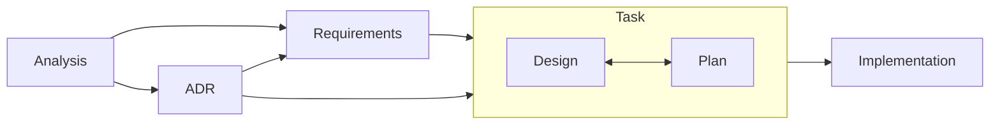

# Traceable Development Lifecycle (TDL)

> Structured phases, linked artifacts, verifiable outcomes

## Metadata

- Type: Process Documentation
- Status: Active

## Links

- Templates Overview: [docs/templates/README.md](templates/README.md)
- Traceability Script: [scripts/trace-status.ts](../scripts/trace-status.ts) (run via `bun scripts/trace-status.ts`)
- ID Generator Script: [scripts/tdl-new-id.ts](../scripts/tdl-new-id.ts)
- Traceability Report: [docs/traceability.md](traceability.md)

This document describes the Traceable Development Lifecycle (TDL), a template-based development process that ensures full traceability from requirements to implementation.

## Overview

The TDL progresses through distinct phases, each with specific deliverables:



**Key paths:**

- Analysis discovers both requirements and architectural concerns
- ADRs can generate new requirements (constraints/standards)
- Both requirements and ADRs feed into design decisions
- Design integrates all inputs before proceeding to plan

## Document Organization

| Phase            | Document Type                | Template                 | Created Files Location                      | Naming Convention                                                      | Lifecycle                                |
| ---------------- | ---------------------------- | ------------------------ | ------------------------------------------- | ---------------------------------------------------------------------- | ---------------------------------------- |
| **Discovery**    | Analysis                     | `analysis.md`            | `docs/analysis/AN-<id>-<topic>.md`          | `AN-<5char-id>-<topic>` (e.g., `AN-a3bf2-cache-optimization.md`)       | Working doc, remains in `docs/analysis/` |
| **Requirements** | Functional Requirement       | `requirements.md`        | `docs/requirements/FR-<id>-<capability>.md` | `FR-<5char-id>-<capability>` (e.g., `FR-b4cd8-user-authentication.md`) | Long-lived, evolve independently         |
|                  | Non-Functional Requirement   | `requirements.md`        | `docs/requirements/NFR-<id>-<quality>.md`   | `NFR-<5char-id>-<quality>` (e.g., `NFR-c5de9-performance.md`)          | Long-lived, evolve independently         |
| **Decisions**    | Architecture Decision Record | `adr.md` / `adr-lite.md` | `docs/adr/ADR-<id>-<title>.md`              | `ADR-<5char-id>-<title>` (e.g., `ADR-d6ef0-cache-storage-format.md`)   | Long-lived, document decisions           |
| **Tasks**        | Task README                  | `task.md`                | `docs/tasks/T-<id>-<name>/README.md`        | `T-<5char-id>-<name>/README.md`                                        | Task-scoped container                    |
|                  | Task Design                  | `design.md`              | `docs/tasks/T-<id>-<name>/design.md`        | Fixed name `design.md` within task directory                           | Task-scoped                              |
|                  | Task Plan                    | `plan.md`                | `docs/tasks/T-<id>-<name>/plan.md`          | Fixed name `plan.md` within task directory                             | Task-scoped                              |
| **Tracking**     | Traceability Report          | (Generated)              | `docs/traceability.md`                      | Single file (project document)                                         | Long-lived, central N:M mapping          |

## Task Creation Guidelines

- When Analysis or ADR work identifies concrete follow-up implementation, create a new task directory at `docs/tasks/T-<id>-<name>/` immediately.
- Always add a `README.md` inside the task directory as the first artifact. Use [`templates/task.md`](templates/task.md) to populate the README so it captures task metadata (type, owner, reviewers, status), a concise summary, source links, and the initial checklist of outstanding work.
- Additional task documents (`design.md`, `plan.md`, etc.) build on top of the README, but the README must ship with the directory from the moment the task is introduced.
- Keep the task README's Links section synchronized with `Associated Plan Document`, and `Associated Design Document` entries; use `N/A – <reason>` if an entry does not apply yet.

## Supporting Automation

### ID generation (`scripts/tdl-new-id.ts`)

- Execute `./scripts/tdl-new-id.ts` to print a collision-resistant, base36 document ID.
- The script scans existing TDL documents once, so it scales across large worktrees.
- Optional environment overrides:
  - `DOCS_DIR` (default: `docs`) points to the directory tree to scan for IDs.
  - `ID_LEN` (default: `5`) controls the generated length; invalid values fall back to the default with a warning.

### Traceability status (`scripts/trace-status.ts`)

- `bun scripts/trace-status.ts` prints the gap summary and consistency checks, marking issues with `⚠` and healthy sections with `✓`.
- `bun scripts/trace-status.ts --status` adds coverage metrics and document counts by type for dashboard-grade reporting.
- `--check` exits with status code `1` when gaps exist (suitable for CI). Combine with `--write[=path]` to emit a markdown report without committing it.
- `--write` without a path writes `docs/traceability.md`; `--write=custom/path.md` writes to a custom location.

Tasks may occasionally be introduced directly at the task phase without an upstream analysis, requirement, or ADR document. Treat these as ad hoc work: keep their scope documented in the task README and rely on `bun scripts/trace-status.ts` to flag the missing upstream links until the upstream document is authored or the task is completed.

## Parallel Development Support

This project supports parallel development using git-worktree with unique IDs to prevent conflicts.

**→ See [`parallel-development.md`](parallel-development.md) for details on:**

- 5-character random ID generation
- Avoiding merge conflicts
- On-demand traceability viewing
- Migration from sequential IDs

## Development Workflow Steps

### Step 1: Analysis (exploration/discovery)

- **Purpose**: Explore problem space, gather data, understand stakeholder needs
  - Be exploratory - it's OK to have uncertainties
  - Document what you learn as you learn it
  - Focus on understanding the problem before jumping to solutions
  - Keep it lightweight - this is a working document
  - Transition discovered requirements to formal FR/NFR documents when ready
- **Template**: [`templates/analysis.md`](templates/analysis.md) - Template for exploratory analysis and problem space investigation. Used to discover requirements through research and stakeholder analysis
- **Output**: List of discovered requirements (FR-DRAFT, NFR-DRAFT) and architectural concerns
- **Location**: `docs/analysis/AN-<id>-<topic>.md` (remains in place after completion)
- **Naming**: `AN-<id>-<topic>` format (e.g., `AN-a3bf2-cache-optimization.md`)
- **ID Generation**: Run `./scripts/tdl-new-id.ts` (see [`parallel-development.md`](parallel-development.md))
- **Transition**: Analysis can lead to:
  - Creating formal requirements from discoveries
  - Identifying architectural decisions that need to be made
- **Traceability Update**: Fill `Related Analyses`/`Related Requirements`/`Related ADRs`/`Related Tasks` in the Links section and add the analysis to `docs/traceability.md` immediately upon creation

### Step 2: Requirements (what/why)

- **Purpose**: Formalize individual requirements with clear acceptance criteria
- **Guidance**: Describe requirements as implementation-independent problems to solve, avoiding assumptions about specific solutions
- **Template**: [`templates/requirements.md`](templates/requirements.md) - Template for individual requirement documents (FR-<id>-<capability> or NFR-<id>-<quality>). Each requirement is a standalone, long-lived document
- **Output**: Formal requirements with IDs (`FR-<id>-<capability>`, `NFR-<id>-<quality>`), measurable criteria
- **Location**: `docs/requirements/FR-<id>-<capability>.md` and `docs/requirements/NFR-<id>-<quality>.md`
- **Naming**: `FR-<id>-<capability>` and `NFR-<id>-<quality>` format
- **ID Generation**: Run `./scripts/tdl-new-id.ts` (see [`parallel-development.md`](parallel-development.md))
- **Sources**: Can come from:
  - Analysis documents (discovered requirements)
  - ADR decisions (derived requirements/constraints)
- **Transition**: When a requirement is ready for implementation, create a task container (`docs/tasks/T-<id>-<name>/README.md`) using [`templates/task.md`](templates/task.md) before drafting design work
- **Relationships**: One analysis can discover multiple requirements; requirements can span multiple tasks (N:M)
- **Traceability Update**:
  - Populate the `Links` section using the template labels: `Prerequisite Requirements`, `Dependent Requirements`, `Related Tasks`
  - Record upstream prerequisites and downstream dependents so the Requirement Dependencies table remains accurate
  - Add each new requirement to the Traceability Matrix generated by `scripts/trace-status.ts`

### Step 3: Architecture Decisions (decisions/trade-offs)

- **Purpose**: Make and document significant architecture/design decisions
  - Verify against existing implementation before documenting decisions
  - Check actual code for directory structures, constants, and naming conventions
  - Don't assume patterns from other tools apply - each project has its own conventions
  - Reference specific code locations when describing current state
  - Document both the decision and its rationale with concrete examples
- **Templates**:
  - [`templates/adr.md`](templates/adr.md) - Full ADR template for architecturally significant decisions, broad impact, or important trade-offs
  - [`templates/adr-lite.md`](templates/adr-lite.md) - Lightweight ADR for tactical choices with limited scope and clear best practices
- **Output**: ADR documents with decisions, rationale, and consequences
- **Location**: `docs/adr/ADR-<id>-<title>.md` (new) or `docs/archive/adr/###-<title>.md` (legacy)
- **Naming**: `ADR-<id>-<descriptive-title>.md` (e.g., `ADR-d6ef0-cache-storage-format.md`)
- **ID Generation**: Run `./scripts/tdl-new-id.ts` (see [`parallel-development.md`](parallel-development.md))
- **Sources**: Triggered by analysis findings or implementation needs
- **Transition**: ADRs can:
  - Generate new requirements (constraints/standards)
  - Feed directly into design for architectural constraints
  - Initiate implementation work by creating a task container (`docs/tasks/T-<id>-<name>/README.md`) with [`templates/task.md`](templates/task.md) when action is required
- **Traceability Update**:
  - Use the template link labels `Impacted Requirements`, `Supersedes ADRs` and `Related Tasks`
  - Update the affected requirements' `Supersedes ADRs` entries and add derived requirements where needed

### Task Kickoff (execution container)

- **Purpose**: Establish the execution container that ties requirements and ADR decisions to downstream design and plan work
- **Template**: [`templates/task.md`](templates/task.md) - Task README capturing scope, links, status, and success metrics
- **Output**: `docs/tasks/T-<id>-<name>/README.md` seeded with metadata, Links, and initial context
- **Sources**:
  - Requirements marked ready for implementation
  - ADR decisions that mandate follow-up work
- **Location**: `docs/tasks/T-<id>-<name>/README.md`
- **Naming**: `T-<id>-<name>` directory created via `./scripts/tdl-new-id.ts`
- **Transition**: With the task README in place, proceed to author the corresponding `design.md` followed by `plan.md` within the same task directory
- **Traceability Update**:
  - Link back to originating requirements and ADRs using the task template's `Links` section
  - Add the new task to `docs/traceability.md` via `bun scripts/trace-status.ts --write`

### Step 4: Design (how to implement)

- **Purpose**: Technical design for implementing requirements within architecture constraints
- **Template**: [`templates/design.md`](templates/design.md) - Task-specific design document. References requirement IDs and documents how to implement them
- **Output**: Component design, data flows, APIs, error handling strategy
- **Sources**: Integrates inputs from:
  - Requirements (what needs to be built)
  - ADRs (architectural constraints and decisions)
- **References**: FR/NFR IDs and relevant ADRs (don't duplicate requirement text)
- **Location**: `docs/tasks/T-<id>-<task>/design.md` (task-scoped)
- **Naming**: Task directory + fixed name (e.g., `docs/tasks/T-e7fa1-cache-refresh/design.md`)
- **ID Generation**: Run `./scripts/tdl-new-id.ts` for the task directory (see [`parallel-development.md`](parallel-development.md))
- **Transition**: With the task README and design complete, create the execution plan. This transition is mandatory for every task—`design.md` must exist (even if brief) before `plan.md` is started.
- **Traceability Update**:
  - Add the task to the Traceability Matrix and ensure requirement coverage is reflected
  - Maintain `Associated Plan Document` within the design's Links section using the template wording

### Step 5: Plan & Execution (phases/tasks)

- **Purpose**: Break down implementation into manageable phases with clear verification. Begin this step only after the corresponding `design.md` has been finalized.
- **Architecture Alignment**: Before drafting tasks, reconcile the plan with the most recent ADRs/Design decisions. If existing code or dependencies conflict with the approved approach, note the discrepancy in the plan and add an explicit subtask to retire or migrate the legacy pattern.
- **Template**: [`templates/plan.md`](templates/plan.md) - Task-specific implementation plan. Breaks down work into phases with verification steps
- **Output**: Phased execution plan with tasks, verification steps, and DoD
- **References**: FR/NFR IDs being implemented, link to design.md
- **Status Tracking**: Mark each completed task or subtask checkbox as `[x]` immediately. If you intentionally skip or defer work, annotate the checklist entry (e.g., strike-through with a note) instead of leaving it unchecked.
- **Verification**: Use commands from `CLAUDE.md`:
  - `cargo check`, `cargo fmt`, `cargo clippy --all-targets -- -D warnings`
  - `cargo test --lib --quiet`, `cargo it`, `cargo perf`, `cargo bench`
- **Location**: `docs/tasks/T-<id>-<task>/plan.md` (task-scoped)
- **Naming**: Task directory + fixed name (e.g., `docs/tasks/T-e7fa1-cache-refresh/plan.md`)
- **Transition**: Execute the plan, updating status and traceability matrix
- **Phase Independence**: Each phase must be self-contained and executable independently:
  - Context may be reset between phases (`/clear` command)
  - Critical information must be documented in phase deliverables
  - Dependencies between phases must be explicitly stated
- **Traceability Update**:
  - Update requirement status as decisions land (`Draft` until validated, `Approved` when implementation is authorized, `Rejected` if we decline to proceed)
  - Keep the plan's `Links` section aligned with `Associated Design Document`

## Common Documentation Requirements

These requirements apply to ALL documentation templates (Analysis, Requirements, ADRs, Task README, Design, and Plan):

### Document Structure

- **Metadata**: Include Type/Owner/Reviewers/Status consistently at the top of every document
- **Document IDs**: Must appear in the filename; include them in Metadata only when the relevant template requires it
- **Links Section**: Mandatory in every template for traceability. If something doesn't apply, write: `N/A – <reason>`
- **Change History**: Use Git history (`git log --follow <file>`). Templates intentionally omit Change Log sections to avoid duplication

### Writing Standards

- **Language**: All documentation must be written in English (per `CLAUDE.md` policy)
- **Date Format**: Use `YYYY-MM-DD` format consistently
- **IDs & Naming**: Use explicit, stable IDs/names. Avoid vague terms like "manager" or "util" (per `CLAUDE.md`)
- **Consistency**: Don't duplicate requirements text; Design references requirement IDs; Plan references both

### Linking & Cross-References

- **Cross-linking**: Use relative links between documents
- **Links vs External References**: Maintain clear distinction:
  - **Links**: Internal project artifacts only (files in repo, issues, PRs) for traceability
  - **External References**: External resources only (standards, articles, documentation)
  - **Simple rule**: "Repository or internal tracker? → Links. Everything else? → External References"
- **ID Usage**: Use FR/NFR/ADR IDs throughout documentation
- **Document Flow**: Cross-link Requirements → Design → Plan documents
- **Requirements Mapping**: Include Requirements Mapping table in Design documents
- **Test References**: Reference IDs in tests where feasible

**Link Label Conventions**

| Template                 | Expected Link Labels                                                        | Purpose                                               |
| ------------------------ | --------------------------------------------------------------------------- | ----------------------------------------------------- |
| `analysis.md`            | `Related Analyses`, `Related Requirements`, `Related ADRs`, `Related Tasks` | Capture downstream work discovered during exploration |
| `requirements.md`        | `Prerequisite Requirements`, `Dependent Requirements`, `Related Tasks`      | Document requirement lineage and dependencies         |
| `adr.md` / `adr-lite.md` | `Impacted Requirements`, `Supersedes ADRs`, `Related Tasks`                 | Track architectural decisions and their impact        |
| `task.md`                | `Associated Plan Document`, `Associated Design Document`                    | Provide task entry-point context                      |
| `design.md`              | `Associated Plan Document`                                                  | Preserve implementation context                       |
| `plan.md`                | `Associated Design Document`                                                | Preserve implementation context                       |

Use `N/A – <reason>` when a link grouping does not apply.

### Process Requirements

- **Verification**: Use canonical cargo commands from `CLAUDE.md` in Verification blocks and Definition of Done
- **PR Integration**: Link Requirements/Design/Plan and relevant ADRs in PRs; verify DoD items from `AGENTS.md`
- **Legacy Alignment**: Treat detected mismatches between current code and approved ADR/design decisions as risks—record them in the task plan (with follow-up subtasks) instead of inheriting the legacy behavior by default.

## Traceability System

### Traceability Principles

- **Source of Truth**: Each document's Links section maintains its relationships
- **Analysis → Requirements**: Track in analysis document's Links section
- **Requirements → Tasks**: Track in task document's Links section
- **Requirement Dependencies**: Record prerequisites and dependents in requirement documents so the generated Requirement Dependencies table remains accurate
- **In-Doc Links**: All documents must maintain Links sections for traceability
- **Tests**: Reference `FR-<id>`/`NFR-<id>` in test names or comments when feasible
- **Review Order**: Analysis (exploration) → Requirements (scope) → ADR (decisions) → Design (architecture) → Plan (execution)

### Status Viewing Tools

Traceability is maintained through Links sections in each document and viewed on-demand:

```bash
bun scripts/trace-status.ts         # Gaps + consistency highlights
bun scripts/trace-status.ts --status # Add coverage metrics and per-type counts
bun scripts/trace-status.ts --check  # CI mode
# Add --write (optionally with =<path>) to emit `docs/traceability.md`, including the Traceability Matrix and Requirement Dependencies tables
```

**→ See [`parallel-development.md`](parallel-development.md) for implementation details**

### When to Update Links

Update the Links section in documents when:

1. **Analysis Phase**
   - ✅ New analysis document created → Add Links section
   - ✅ Requirements discovered → List them in "Formal Requirements" subsection

2. **Requirements Phase**
   - ✅ New requirement created → Add Links to source analysis/ADR
   - ✅ Requirement affects ADRs → Update Links section

3. **Architecture Decision Phase**
   - ✅ ADR created → Add Links to related requirements
   - ✅ ADR supersedes another → Update both ADRs' Links sections

4. **Task Creation Phase**
   - ✅ New task created → Add Links to requirements being implemented
   - ✅ Task references ADRs → Include in Links section

5. **Implementation Phase**
   - ✅ Status changes → Update Status field in document metadata
   - ✅ New relationships discovered → Update Links sections

6. **Verification**
   - ✅ Run `bun scripts/trace-status.ts` to check for gaps
   - ✅ Fix any orphan requirements or tasks before PR

## Pull Request Checklist

- Link relevant artifacts in the PR description:
  - Source analysis documents if applicable
  - `FR-<id>`/`NFR-<id>` requirements being addressed
  - Affected task folder(s) under `docs/tasks/T-<id>-<task>`
  - Related ADRs
- Automated Verification Checklist:
  - [ ] Format verified: `cargo fmt --check`
  - [ ] Linting clean: `cargo clippy --all-targets -- -D warnings`
  - [ ] All test commands pass: `cargo test --lib --quiet`
  - [ ] Requirements traced: All FR/NFR IDs referenced in code comments where applicable
  - [ ] ADR references: Design decisions linked to ADR numbers
- Manual Verification:
  - [ ] Error messages clear and in English (per `CLAUDE.md`)
  - [ ] Documentation updated (`docs/reference.md`, user docs if needed)
  - [ ] Platform behavior validated when relevant
  - [ ] **Traceability verified**: Run `bun scripts/trace-status.ts --check`
  - [ ] **Links sections updated**: All document relationships current
  - [ ] **No orphan documents**: All requirements have tasks (or are marked as future work)

## Small Changes Variant

- For trivial fixes, you may streamline (but not skip) the workflow if **ALL** these criteria apply:
  - Code changes < 50 lines
  - No new dependencies
  - No API changes
  - No architectural impact
  - Single file modification
  - Estimated execution time < 30 minutes
- Even under this variant, always draft `design.md` before producing `plan.md`. The design can be concise, but it must reference requirements and capture the implementation approach.
- After completing the minimal design, create the corresponding `plan.md` that references the design and enumerates verification steps.
- Ensure all verification commands pass
- **Traceability**: Run `bun scripts/trace-status.ts --check` to verify no gaps

## Archive Policy

- **Analysis documents**: Remain in `docs/analysis/` after requirements are formalized; keep the latest state in place
- **Completed tasks**: Active task directories stay in `docs/tasks/`; legacy task directories moved to `docs/archive/tasks/`
- **Legacy documentation**: Artifacts created before TDL adoption now live under `docs/archive/` (e.g., `docs/archive/adr/`, `docs/archive/tasks/`, `docs/archive/reviews/`)
- **Deprecated requirements**: Update status to "Deprecated" but keep in `docs/requirements/`
- **Superseded ADRs**: Update status and link to superseding ADR
- **Legacy ADRs**: Pre-2025 ADRs stored in `docs/archive/adr/`

## Templates

All TDL templates are located in the [`docs/templates/`](templates/) directory. See the [Templates README](templates/README.md) for detailed instructions on using each template.

### Available Templates

- [`analysis.md`](templates/analysis.md) - Problem exploration and requirement discovery
- [`requirements.md`](templates/requirements.md) - Individual requirement documentation
- [`adr.md`](templates/adr.md) - Full Architecture Decision Record
- [`adr-lite.md`](templates/adr-lite.md) - Lightweight ADR for simple decisions
- [`design.md`](templates/design.md) - Task-specific technical design
- [`plan.md`](templates/plan.md) - Task-specific implementation plan
